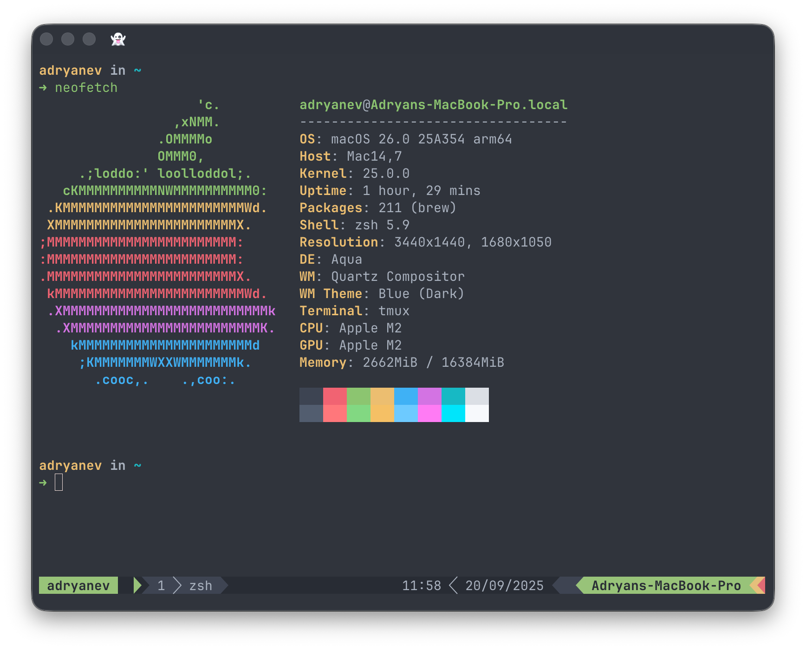

# Dotfiles

Personal dotfiles repository by Adryan Eka Vandra for macOS setup. This repository contains configuration files and scripts to set up a new macOS machine with my preferred development environment.



## Table of Contents

- [Dotfiles](#dotfiles)
  - [Table of Contents](#table-of-contents)
  - [Contents](#contents)
  - [Prerequisites](#prerequisites)
  - [Installation](#installation)
  - [Customization](#customization)
  - [Structure](#structure)
  - [Scripts](#scripts)
  - [Maintenance](#maintenance)
  - [Key Features & Shortcuts](#key-features--shortcuts)
  - [Recent Improvements](#recent-improvements)
  - [License](#license)

## Contents

- **Shell configuration (ZSH)** - Modular configuration with separate files for aliases, PATH, wrappers, and tool initialization
- **macOS system preferences** - Comprehensive system defaults including trackpad gestures, security settings, and window management
- **Homebrew package management** - Automated package installation and updates
- **SSH configuration** - Secure SSH key generation and management
- **Neovim configuration** - Modern text editor setup
- **Ghostty terminal configuration** - GPU-accelerated terminal with true color support, ligatures, and shell integration
- **Git configuration** - Modern Git workflow with auto-setup remote, zdiff3 conflict resolution, and extensive aliases
- **Tmux configuration** - Vim-style navigation, enhanced copy mode, plugin system, and session management
- **Yazi file manager configuration** - Fast terminal file manager with custom keybindings
- **Development tools** - Version management via asdf (Node.js, pnpm, Bun, Go, PHP + Composer, Ruby, Flutter, PostgreSQL)
- **Spaceship Prompt** - Beautiful zsh prompt with git integration and language version display
- **GPG key management** - Secure commit signing setup

## Prerequisites

- macOS
- Command Line Tools for Xcode (will be installed automatically)

## Installation

1. Clone this repository:

   ```bash
   git clone https://github.com/adryanev/dotfiles.git ~/.dotfiles
   cd ~/.dotfiles
   ```

2. Make all scripts executable:

   ```bash
   chmod +x scripts/*.sh
   ```

3. Copy the example environment file and modify as needed:

   ```bash
   cp env/.env-install.example env/.env-install
   ```

4. Run the installation script:

   ```bash
   ./scripts/setup-new-mac.sh
   ```

5. (Optional) Setup GPG for commit signing:

   ```bash
   ./scripts/setup-gpg-key.sh
   ```

The installation will:

- Install Xcode Command Line Tools (if not already installed)
- Install Rosetta 2 (for Apple Silicon Macs)
- Install Oh My Zsh (if not already installed)
- Install Homebrew (if not already installed)
- Install Homebrew packages from `brew/Brewfile`
- Set up SSH keys
- Install CLI tools and plugins (Tmux Plugin Manager, Zsh plugins)
- Install Spaceship Prompt theme for Oh My Zsh
- Apply macOS system preferences
- Create symlinks for dotfiles using custom stow functions
- Configure Git user settings and GPG signing (if configured)
- Create a Code directory for projects
- Set up development environments using asdf (Node.js, pnpm, Bun, Java, PHP + Composer, Go, Ruby, Flutter, PostgreSQL)

## Customization

### Environment Variables
Modify `env/.env-install` to customize installation:
- `SSH_EMAIL`: Email for SSH key generation
- `GIT_USER_NAME`: Your name for Git commits
- `GIT_USER_EMAIL`: Your email for Git commits
- `GIT_SIGNING_KEY`: Your GPG key ID for signing commits (optional)

### Package Management
- **Homebrew**: Edit `brew/Brewfile` to add/remove packages, casks, and Mac App Store apps
- **Development tools**: Modify `scripts/setup-dev-environments.sh` for tool versions

### System Preferences
- **macOS settings**: Update `macos/macos.sh` to change system preferences
- **Hot corners**: Modify lines 405-418 in `macos/macos.sh`
- **Dock apps**: Edit the `APPS` array in `macos/macos.sh` (lines 645-664)

### Shell Configuration
Edit the modular ZSH files in `zsh/.zshrc_sourced/`:
- **Aliases**: `zsh/.zshrc_sourced/.alias` - Add custom command shortcuts
- **PATH**: `zsh/.zshrc_sourced/.path` - Modify environment paths
- **Functions**: `zsh/.zshrc_sourced/.wrapper` - Add utility functions
- **Tools**: `zsh/.zshrc_sourced/.dev` - Configure development tool settings
- **Prompt**: `zsh/.zshrc_sourced/.spaceship` - Customize prompt appearance

### Git & Terminal
- **Git config**: Modify `git/.gitconfig` for aliases and settings
- **Gitignore**: Add patterns to `git/.gitignore_global`
- **Tmux**: Edit `tmux/tmux.conf` for keybindings and plugins
- **Ghostty**: Customize `ghostty/config` for terminal appearance

## Structure

- `scripts/` - Shell scripts with proper error handling and common utilities
  - `setup-new-mac.sh` - Main installation script
  - `install-brew-packages.sh` - Homebrew package installation
  - `setup-ssh-keys.sh` - SSH configuration setup
  - `install-shell-plugins.sh` - Shell environment plugins installation
  - `setup-dev-environments.sh` - Development tools setup via asdf
  - `setup-gpg-key.sh` - Interactive GPG key management
  - `configure-git-user.sh` - Git user configuration
  - `install-spaceship-zsh-theme.sh` - Spaceship Prompt installation
  - `deploy-dotfiles.sh` - Atomic symlink management with custom stow functions
  - `lib/common.sh` - Shared utilities for error handling and logging
- `brew/` - Homebrew configurations
  - `Brewfile` - Homebrew package list
- `macos/` - macOS configurations
  - `macos.sh` - Comprehensive macOS system preferences (Sonoma/Sequoia compatible)
    - General UI/UX (disable auto-correct, smart quotes, text replacement)
    - Input devices (trackpad gestures: tap-to-click, two-finger right-click, three-finger drag)
    - Trackpad gestures (swipe between pages, full-screen apps, Mission Control, App Exposé)
    - Security & privacy (firewall, stealth mode, disable guest account)
    - Energy settings (sleep, hibernation, standby delay)
    - Screen settings (screenshots directory, password requirement)
    - Finder (show hidden files, extensions, path bar, status bar)
    - Dock (auto-hide, hot corners, Mission Control shortcuts)
    - Window management (Stage Manager, tabbing, double-click behavior)
    - Safari (privacy, developer tools)
    - Menu bar (battery %, 24-hour time, Bluetooth/Sound visibility)
    - Dock app configuration (dynamically detects Xcode from xcodes)
- `zsh/` - Zsh configurations
  - `.zshrc` - Main shell configuration with Oh My Zsh and plugin setup
  - `.zprofile` - Zsh profile configuration
  - `.zshrc_sourced/` - Modular Zsh configurations (loaded in order)
    - `.path` - PATH environment variables (Homebrew, Cargo, Go, Android SDK, ASDF, etc.)
    - `.dev` - Development environment setup (Node.js, Python, Go, Android, Bun, Dart/Flutter)
    - `.spaceship` - Spaceship prompt theme customization
    - `.alias` - 30+ aliases for navigation, git, tmux, docker, system management
    - `.wrapper` - Function wrappers (yazi, fzf helpers, git helpers, extract utility)
    - `.eval` - Tool initialization (zoxide, thefuck, asdf, fzf with OneDark theme, direnv)
- `git/` - Git configurations
  - `.gitconfig` - Modern Git configuration with workflow improvements
    - Auto-setup remote, zdiff3 conflicts, histogram diff, rerere
    - 25+ aliases: sw/swc (switch), main, cleanup, save/wip, recent, today, etc.
  - `.gitignore_global` - Comprehensive global ignore patterns
    - macOS, IDEs (VSCode, IntelliJ, Vim), secrets, Node.js, Python, Ruby, Java, Go, PHP
- `tmux/` - Tmux configurations
  - `tmux.conf` - Modern tmux with vim navigation and powerful plugins
    - Vim-style pane navigation (hjkl) and resizing (HJKL)
    - Vi mode copy with proper keybindings (v, y, C-v for rectangle)
    - True color + undercurl support (Ghostty compatible)
    - FZF session switcher (Ctrl+b Ctrl+j)
    - Plugins: vim-navigator, yank, thumbs (Ctrl+b F), fzf, menus, OneDark theme
- `env/` - Environment files
  - `.env-install` - Installation environment variables
  - `.env-install.example` - Example environment file
- `nvim/` - Neovim configuration
- `ghostty/` - Ghostty terminal configuration
  - `config` - Modern terminal emulator settings
    - True color support with OneDark theme
    - Font ligatures (JetBrains Mono Nerd Font)
    - Shell integration (cursor, sudo, title tracking)
    - macOS Option key as Alt
    - Background opacity with blur effect
- `gnupg/` - GnuPG configuration and secure key storage (keys are gitignored)
- `yazi/` - Yazi file manager configuration
  - `yazi.toml` - Main configuration
  - `keymap.toml` - Keyboard mappings
  - `theme.toml` - Theme settings
- `.stow-local-ignore` - GNU Stow ignore patterns

## Scripts

The `scripts/` directory contains shell scripts with proper error handling, logging, and idempotency:

- `setup-new-mac.sh` - The main entry point script that orchestrates the entire installation process. It checks for Xcode Command Line Tools, installs Oh My Zsh, Homebrew, sets up SSH keys, creates necessary directories, and calls all other installation scripts.

- `install-brew-packages.sh` - Handles the installation of all Homebrew packages, casks, and App Store applications using the Brewfile.

- `setup-ssh-keys.sh` - Generates SSH keys if they don't exist and configures SSH with proper permissions. Takes an email address as an argument for the SSH key.

- `install-shell-plugins.sh` - Installs and configures various shell environment plugins:
  - Installs Tmux Plugin Manager (TPM)
  - Installs Zsh plugins (zsh-autosuggestions, fast-syntax-highlighting, zsh-autocomplete)

- `setup-dev-environments.sh` - Sets up development environments using asdf:
  - Manages multiple versions of Node.js, Java, PHP, Go, Ruby
  - Installs pnpm, Bun, Flutter, and PostgreSQL
  - PHP installation includes Composer automatically (via asdf-php plugin)
  - Configurable version numbers via environment variables
  - Installs latest Xcode using xcodes (if available)

- `setup-gpg-key.sh` - Interactive GPG key management:
  - Generate new GPG keys or import existing ones
  - Export keys to secure storage (gitignored)
  - Configure Git for commit signing
  - Test GPG signing functionality

- `configure-git-user.sh` - Configures Git user settings and GPG signing:
  - Sets username and email for Git commits
  - Configures GPG signing key (if provided)
  - Creates .gitconfig with appropriate settings

- `install-spaceship-zsh-theme.sh` - Installs and configures the Spaceship Prompt theme for Oh My Zsh:
  - Clones the Spaceship repository
  - Symlinks the theme to the Oh My Zsh themes directory
  - Sets up custom Spaceship theme configuration

- `deploy-dotfiles.sh` - Manages symlinks with atomic operations:
  - Creates symlinks for configuration files to their appropriate locations
  - Handles backup of existing dotfiles with timestamps
  - Uses atomic operations to prevent partial updates
  - Manages conflicts and helps ensure a clean installation

- `lib/common.sh` - Shared library for all scripts:
  - Proper error handling with `set -euo pipefail`
  - Colored logging functions (info, warn, error)
  - Safe symlink creation with automatic backups
  - Retry mechanism for network operations
  - Common utility functions

## Maintenance

To update Homebrew packages:

```bash
brew bundle --file=~/.dotfiles/brew/Brewfile
```

To update dotfiles:

```bash
cd ~/.dotfiles
git pull
./scripts/setup-new-mac.sh
```

To manage GPG keys:

```bash
./scripts/setup-gpg-key.sh
```

## Key Features & Shortcuts

### Shell (ZSH)
- **Smart navigation**: `z project` (zoxide), `..`, `...`, `....`
- **FZF integration**: `fe` (file search), `fkill` (process killer), `gcof` (git branch checkout)
- **Quick edits**: `reload`, `zshrc`, `aliases`
- **Development**: `list-tools`, `ports`, `myip`, `serve`
- **Utilities**: `mkcd dir`, `extract file.tar.gz`

### Tmux
- **Vim navigation**: `Ctrl+b h/j/k/l` (panes), `Ctrl+b H/J/K/L` (resize)
- **Session management**: `Ctrl+b Ctrl+j` (FZF session switcher)
- **Copy mode**: `Ctrl+b [` (enter), `v` (select), `y` (yank), `/` (search)
- **Quick text**: `Ctrl+b F` (thumbs mode)
- **Sync panes**: `Ctrl+b S` (toggle synchronize)

### Git
- **Modern workflow**: `git sw branch`, `git main` (jump to default branch)
- **Quick saves**: `git save`, `git wip`, `git uncommit`
- **Cleanup**: `git cleanup` (delete merged branches), `git prune-all`
- **Info**: `git recent` (branches by date), `git today` (today's commits), `git whoami`

### macOS
- **Hot corners**: Top-left (Mission Control), Top-right (Desktop), Bottom-left (Lock), Bottom-right (Launchpad)
- **Trackpad gestures**: Two-finger swipe (pages), Four-finger swipe (full-screen apps), Spread (desktop)

## Recent Improvements

### 2025 Major Update
- **Modular ZSH Configuration**: Separated into 6 logical files (.path, .dev, .spaceship, .alias, .wrapper, .eval)
  - 30+ new aliases for navigation, git, tmux, docker, and system management
  - Enhanced FZF integration with OneDark theme
  - Smart tool initialization with conditional loading
  - 8+ new utility functions (fcd, fe, fkill, gcof, mkcd, extract)

- **Modern Tmux Setup**: Complete rewrite with vim-style workflow
  - Vim-style pane navigation (hjkl) and resizing (HJKL)
  - Vi mode in copy mode with proper selection/yank bindings
  - FZF session switcher for quick navigation
  - Enhanced plugin system (vim-navigator, thumbs, yank, fzf, menus)
  - True color + undercurl support for modern Neovim

- **Enhanced Git Configuration**: Modern workflow improvements
  - Auto-setup remote for new branches (no more `--set-upstream`)
  - zdiff3 conflict style (shows common ancestor)
  - Histogram diff algorithm (more accurate)
  - Rerere (reuse recorded resolution)
  - 25+ new aliases for common workflows

- **Comprehensive Global Gitignore**: 200+ ignore patterns
  - All major IDEs (VSCode, IntelliJ, Vim, Fleet, Sublime)
  - Environment files and secrets (.env*, certificates, keys)
  - All major languages (Node.js, Python, Ruby, Java, Go, PHP, Rust)
  - Framework-specific (Next.js, Nuxt, Turbo, Vercel, Django, Rails)

- **macOS System Preferences**: Updated for Sonoma/Sequoia
  - Complete trackpad gesture configuration
  - Security enhancements (firewall, stealth mode)
  - Window management (Stage Manager, tabbing)
  - Menu bar customization (24-hour time, battery %)
  - Dynamic Xcode detection (xcodes compatibility)

- **Ghostty Terminal**: Modern GPU-accelerated terminal
  - Programming ligatures enabled (JetBrains Mono)
  - Shell integration (cursor tracking, sudo detection)
  - True color with OneDark theme
  - macOS-specific optimizations

### Previous Improvements
- **Enhanced Error Handling**: All scripts use `set -euo pipefail` and proper error trapping
- **Atomic Operations**: Symlink creation is atomic to prevent partial updates
- **asdf Version Management**: Replaced NVM with asdf for consistent tool version management
- **GPG Key Management**: Secure GPG key setup and commit signing
- **Common Library**: Shared utilities reduce code duplication
- **Configurable Versions**: Development tool versions via environment variables

## License

This project is licensed under the MIT License - see the [LICENSE](LICENSE) file for details.
