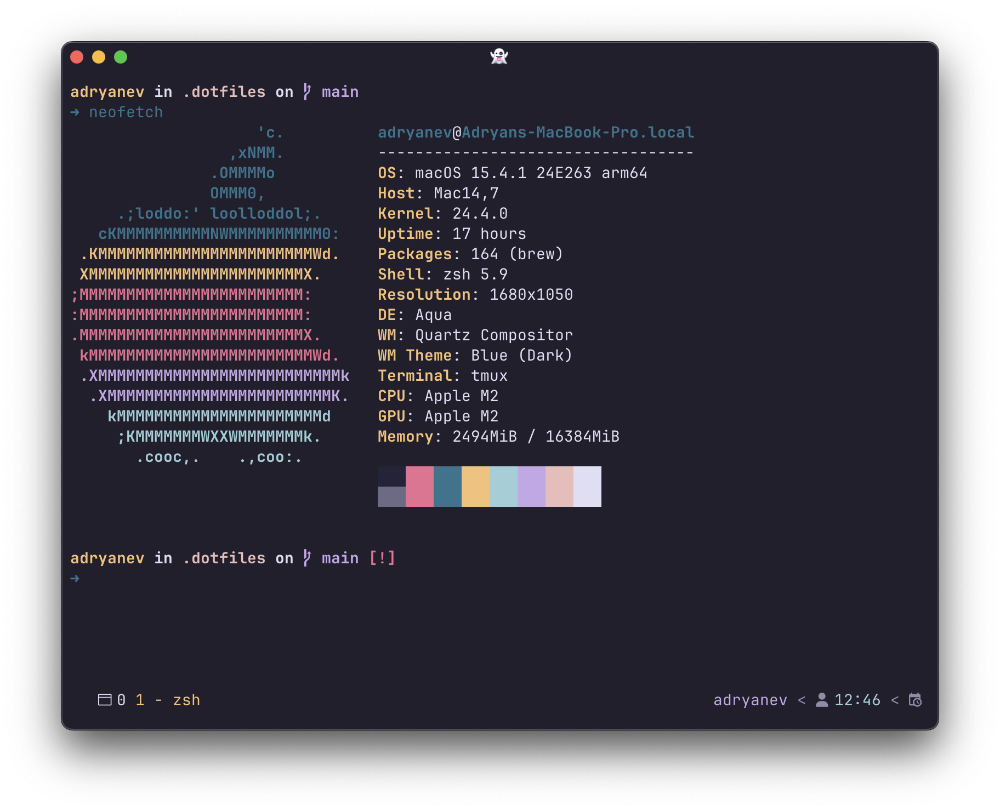

# Dotfiles

Personal dotfiles repository by Adryan Eka Vandra for macOS setup. This repository contains configuration files and scripts to set up a new macOS machine with my preferred development environment.



## Table of Contents

- [Dotfiles](#dotfiles)
  - [Table of Contents](#table-of-contents)
  - [Contents](#contents)
  - [Prerequisites](#prerequisites)
  - [Installation](#installation)
  - [Customization](#customization)
  - [Structure](#structure)
  - [Maintenance](#maintenance)
  - [License](#license)

## Contents

- Shell configuration (ZSH)
- macOS system preferences
- Homebrew package management
- SSH configuration
- Neovim configuration
- Ghostty terminal configuration
- Git configuration (with GPG signing support)
- Tmux configuration
- Development tools configuration (nvm, Bun)
- Spaceship Prompt theme for Oh My Zsh

## Prerequisites

- macOS

## Installation

1. Clone this repository:

   ```bash
   git clone https://github.com/adryanev/dotfiles.git ~/.dotfiles
   cd ~/.dotfiles
   ```

2. Make all scripts executable:

   ```bash
   chmod +x scripts/*.sh
   ```

3. Copy the example environment file and modify as needed:

   ```bash
   cp env/.env-install.example env/.env-install
   ```

4. Run the installation script:

   ```bash
   ./scripts/install.sh
   ```

This will:

- Install Xcode Command Line Tools (if not already installed)
- Install Oh My Zsh (if not already installed)
- Install Homebrew (if not already installed)
- Install Homebrew packages from `brew/Brewfile`
- Set up SSH keys
- Install CLI tools and plugins (Tmux Plugin Manager, Zsh plugins)
- Install Spaceship Prompt theme for Oh My Zsh
- Apply macOS system preferences
- Create symlinks for dotfiles using GNU Stow
- Configure Git user settings and GPG signing (if configured)
- Create a Code directory for projects

## Customization

1. Modify the `env/.env-install` file to customize installation options:
   - `SSH_EMAIL`: Email for SSH key generation
   - `GIT_USER_NAME`: Your name for Git commits
   - `GIT_USER_EMAIL`: Your email for Git commits
   - `GIT_SIGNING_KEY`: Your GPG key ID for signing Git commits (optional)
2. Edit the `brew/Brewfile` to add or remove Homebrew packages
3. Update `macos/.macos` to change macOS system preferences
4. Modify shell configurations in `zsh/.zshrc` and `zsh/.zprofile`
5. Adjust `.stow-local-ignore` if you need to exclude certain files from being symlinked

## Structure

- `scripts/` - Shell scripts
  - `install.sh` - Main installation script
  - `brew.sh` - Homebrew package installation
  - `ssh.sh` - SSH configuration setup
  - `install-cli-stuff.sh` - CLI tools and plugins installation
  - `install-node-flutter.sh` - Node.js and Flutter setup
  - `setup-git-config.sh` - Git user configuration
  - `install-spaceship.sh` - Spaceship Prompt installation
  - `stow.sh` - Symlink management using GNU Stow
- `brew/` - Homebrew configurations
  - `Brewfile` - Homebrew package list
- `macos/` - macOS configurations
  - `.macos` - macOS system preferences
- `zsh/` - Zsh configurations
  - `.zshrc` - Zsh shell configuration
  - `.zprofile` - Zsh profile configuration
  - `.devrc` - Development tools configuration (nvm, Bun)
- `git/` - Git configurations
  - `.gitconfig` - Git configuration
  - `.gitignore_global` - Global Git ignore patterns
- `tmux/` - Tmux configurations
  - `.tmux.conf` - Tmux configuration
- `env/` - Environment files
  - `.env-install` - Installation environment variables
  - `.env-install.example` - Example environment file
- `nvim/` - Neovim configuration
- `ghostty/` - Ghostty terminal configuration
- `gnupg/` - GnuPG configuration
- `.stow-local-ignore` - GNU Stow ignore patterns

## Maintenance

To update Homebrew packages:

```bash
brew bundle --file=~/.dotfiles/brew/Brewfile
```

To update dotfiles:

```bash
cd ~/.dotfiles
git pull
./scripts/install.sh
```

## License

This project is licensed under the MIT License - see the [LICENSE](LICENSE) file for details.
