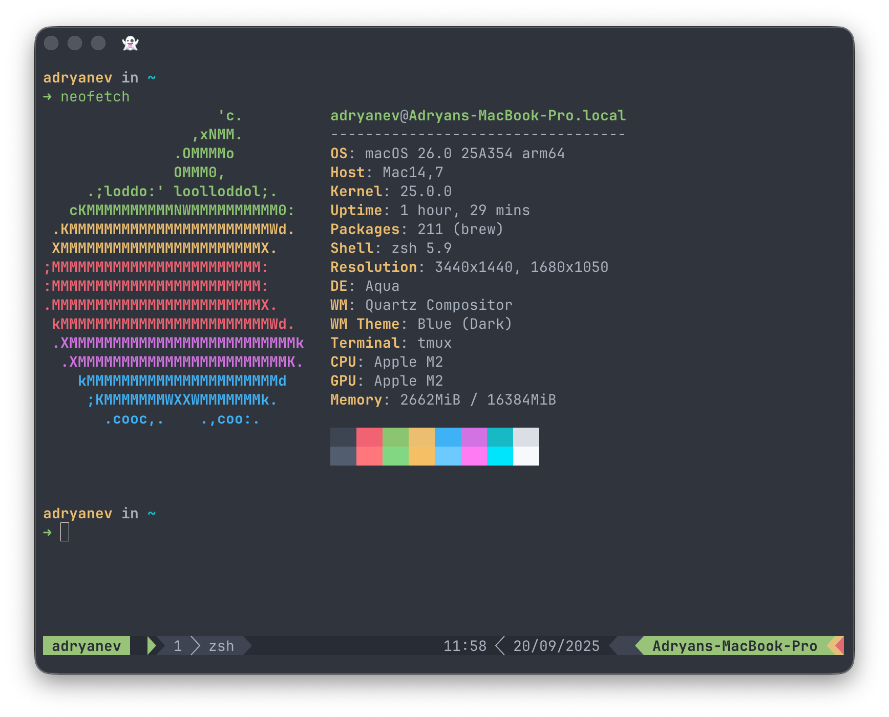

# Dotfiles

Personal dotfiles repository by Adryan Eka Vandra for macOS setup. This repository contains configuration files and scripts to set up a new macOS machine with my preferred development environment.



## Table of Contents

- [Dotfiles](#dotfiles)
  - [Table of Contents](#table-of-contents)
  - [Contents](#contents)
  - [Prerequisites](#prerequisites)
  - [Installation](#installation)
  - [Customization](#customization)
  - [Structure](#structure)
  - [Scripts](#scripts)
  - [Language Servers](#language-servers)
  - [AI Agent Tooling](#ai-agent-tooling)
  - [Maintenance](#maintenance)
  - [Key Features & Shortcuts](#key-features--shortcuts)
  - [Recent Improvements](#recent-improvements)
  - [License](#license)

## Contents

- **Shell configuration (ZSH)** - Modular configuration with separate files for aliases, PATH, wrappers, and tool initialization
- **macOS system preferences** - Comprehensive system defaults including trackpad gestures, security settings, and window management
- **Homebrew package management** - Automated package installation and updates
- **SSH configuration** - Secure SSH key generation and management
- **Neovim configuration** - Modern text editor setup
- **Ghostty terminal configuration** - GPU-accelerated terminal with true color support, ligatures, and shell integration
- **Git configuration** - Modern Git workflow with auto-setup remote, zdiff3 conflict resolution, and extensive aliases
- **Tmux configuration** - Vim-style navigation, enhanced copy mode, plugin system, and session management
- **Yazi file manager configuration** - Fast terminal file manager with custom keybindings
- **Development tools** - Version management via asdf (Node.js, pnpm, Bun, Go, PHP + Composer, Ruby, Flutter, PostgreSQL)
- **Language servers** - One LSP per language installed system-wide, available to every editor and to CLI tooling
- **Spaceship Prompt** - Beautiful zsh prompt with git integration and language version display
- **GPG key management** - Secure commit signing setup
- **Encrypted secret backup** - SSH keys, GPG key and service credentials in an encrypted iCloud archive; no private keys are stored in this repository
- **AI agent tooling** - MCP servers (serena, codebase-memory-mcp, tablepro) registered for Claude Code, claudex, Codex, OpenCode and Cursor
- **cliproxyapi** - Local API proxy that `claudex` runs Claude Code against

## Prerequisites

- macOS
- Command Line Tools for Xcode (will be installed automatically)

## Installation

1. Clone this repository:

   ```bash
   git clone https://github.com/adryanev/dotfiles.git ~/.dotfiles
   cd ~/.dotfiles
   ```

2. Make all scripts executable:

   ```bash
   chmod +x scripts/*.sh
   ```

3. Copy the example environment file and modify as needed:

   ```bash
   cp env/.env-install.example env/.env-install
   ```

4. Run the installation script:

   ```bash
   ./scripts/setup-new-mac.sh
   ```

5. (Optional) Setup GPG for commit signing:

   ```bash
   ./scripts/setup-gpg-key.sh
   ```

The installation will:

- Install Xcode Command Line Tools (if not already installed)
- Install Rosetta 2 (for Apple Silicon Macs)
- Install Oh My Zsh (if not already installed)
- Install Homebrew (if not already installed)
- Install Homebrew packages from `brew/Brewfile`
- Set up SSH keys
- Install CLI tools and plugins (Tmux Plugin Manager, Zsh plugins)
- Install Spaceship Prompt theme for Oh My Zsh
- Apply macOS system preferences
- Create symlinks for dotfiles using custom stow functions
- Configure Git user settings and GPG signing (if configured)
- Create a Code directory for projects
- Set up development environments using asdf (Node.js, pnpm, Bun, Java, PHP + Composer, Go, Ruby, Flutter, PostgreSQL)

## Customization

### Environment Variables
Modify `env/.env-install` to customize installation:
- `SSH_EMAIL`: Email for SSH key generation
- `GIT_USER_NAME`: Your name for Git commits
- `GIT_USER_EMAIL`: Your email for Git commits
- `GIT_SIGNING_KEY`: Your GPG key ID for signing commits (optional)
- `BACKUP_ENCRYPTION_PASSPHRASE`: Passphrase for `pre-reinstall-backup.sh` / `post-reinstall-restore.sh`; set it to run those non-interactively, leave blank to be prompted

Shell secrets like `LEXICON_MCP_TOKEN` and `OLLAMA_API_KEY` are not part of `.env-install` — they live only in `~/.zshrc_local` (untracked) and are carried across machines via `pre-reinstall-backup.sh` / `post-reinstall-restore.sh`, not via `.env-install`.

### Package Management
- **Homebrew**: Edit `brew/Brewfile` to add/remove packages, casks, and Mac App Store apps
- **Development tools**: Modify `scripts/setup-dev-environments.sh` for tool versions

### System Preferences
- **macOS settings**: Update `macos/macos.sh` to change system preferences
- **Hot corners**: Modify lines 405-418 in `macos/macos.sh`
- **Dock apps**: Edit the `APPS` array in `macos/macos.sh` (lines 645-664)

### Shell Configuration
Edit the modular ZSH files in `zsh/.zshrc_sourced/`:
- **Aliases**: `zsh/.zshrc_sourced/.alias` - Add custom command shortcuts
- **PATH**: `zsh/.zshrc_sourced/.path` - Modify environment paths
- **Functions**: `zsh/.zshrc_sourced/.wrapper` - Add utility functions
- **Tools**: `zsh/.zshrc_sourced/.dev` - Configure development tool settings
- **Prompt**: `zsh/.zshrc_sourced/.spaceship` - Customize prompt appearance

### Git & Terminal
- **Git config**: Modify `git/.gitconfig` for aliases and settings
- **Gitignore**: Add patterns to `git/.gitignore_global`
- **Tmux**: Edit `tmux/tmux.conf` for keybindings and plugins
- **Ghostty**: Customize `ghostty/config` for terminal appearance

## Structure

- `scripts/` - Shell scripts with proper error handling and common utilities
  - `setup-new-mac.sh` - Main installation script
  - `install-brew-packages.sh` - Homebrew package installation
  - `setup-ssh-keys.sh` - SSH configuration setup
  - `install-shell-plugins.sh` - Shell environment plugins installation
  - `setup-dev-environments.sh` - Development tools setup via asdf
  - `setup-gpg-key.sh` - Interactive GPG key management
  - `configure-git-user.sh` - Git user configuration
  - `install-spaceship-zsh-theme.sh` - Spaceship Prompt installation
  - `deploy-dotfiles.sh` - Atomic symlink management with custom stow functions
  - `setup-codebase-memory.sh` - codebase-memory-mcp with the graph UI
  - `setup-mcp-servers.sh` - MCP server registration for Claude Code and claudex
  - `start-tmux.sh` - Terminal startup shell: attach to the tmux session or create it
  - `pre-reinstall-backup.sh` / `post-reinstall-restore.sh` - Encrypted secret backup and restore
  - `lib/common.sh` - Shared utilities for error handling and logging
- `brew/` - Homebrew configurations
  - `Brewfile` - Homebrew package list
- `macos/` - macOS configurations
  - `macos.sh` - Comprehensive macOS system preferences (Sonoma/Sequoia compatible)
    - General UI/UX (disable auto-correct, smart quotes, text replacement)
    - Input devices (trackpad gestures: tap-to-click, two-finger right-click, three-finger drag)
    - Trackpad gestures (swipe between pages, full-screen apps, Mission Control, App Exposé)
    - Security & privacy (firewall, stealth mode, disable guest account)
    - Energy settings (sleep, hibernation, standby delay)
    - Screen settings (screenshots directory, password requirement)
    - Finder (show hidden files, extensions, path bar, status bar)
    - Dock (auto-hide, hot corners, Mission Control shortcuts)
    - Window management (Stage Manager, tabbing, double-click behavior)
    - Safari (privacy, developer tools)
    - Menu bar (battery %, 24-hour time, Bluetooth/Sound visibility)
    - Dock app configuration (dynamically detects Xcode from xcodes)
- `zsh/` - Zsh configurations
  - `.zshrc` - Main shell configuration with Oh My Zsh and plugin setup
  - `.zprofile` - Zsh profile configuration
  - `.zshrc_sourced/` - Modular Zsh configurations (loaded in order)
    - `.path` - PATH environment variables (Homebrew, Cargo, Go, Android SDK, ASDF, etc.)
    - `.dev` - Development environment setup (Node.js, Python, Go, Android, Bun, Dart/Flutter)
    - `.spaceship` - Spaceship prompt theme customization
    - `.alias` - 30+ aliases for navigation, git, tmux, docker, system management
    - `.wrapper` - Function wrappers (yazi, fzf helpers, git helpers, extract utility)
    - `.eval` - Tool initialization (zoxide, thefuck, asdf, fzf with OneDark theme, direnv)
- `git/` - Git configurations
  - `.gitconfig` - Modern Git configuration with workflow improvements
    - Auto-setup remote, zdiff3 conflicts, histogram diff, rerere
    - 25+ aliases: sw/swc (switch), main, cleanup, save/wip, recent, today, etc.
  - `.gitignore_global` - Comprehensive global ignore patterns
    - macOS, IDEs (IntelliJ, Vim), secrets, Node.js, Python, Ruby, Java, Go, PHP
- `tmux/` - Tmux configurations
  - `tmux.conf` - Modern tmux with vim navigation and powerful plugins
    - Vim-style pane navigation (hjkl) and resizing (HJKL)
    - Vi mode copy with proper keybindings (v, y, C-v for rectangle)
    - True color + undercurl support (Ghostty compatible)
    - FZF session switcher (Ctrl+b Ctrl+j)
    - Plugins: vim-navigator, yank, thumbs (Ctrl+b F), fzf, menus, OneDark theme
- `env/` - Environment files
  - `.env-install` - Installation environment variables
  - `.env-install.example` - Example environment file
- `nvim/` - Neovim configuration
- `ghostty/` - Ghostty terminal configuration
  - `config` - Modern terminal emulator settings
    - True color support with OneDark theme
    - Font ligatures (JetBrains Mono Nerd Font)
    - Shell integration (cursor, sudo, title tracking)
    - macOS Option key as Alt
    - Background opacity with blur effect
- `kitty/` - Kitty terminal configuration
  - `kitty.conf` - Settings ported from the Ghostty config (One Double Dark theme)
    - `shell` launches `scripts/start-tmux.sh`, which attaches to the `adryanev`
      tmux session or creates it. The path is absolute because kitty does not
      expand `~` or `$HOME` in that option, and the script prepends Homebrew to
      `PATH` because a GUI-launched process inherits launchd's minimal `PATH`
      and would not otherwise find tmux.
- `cliproxyapi/` - Local API proxy configuration
  - `config.yaml.example` - Template; the real config holds secrets and is not tracked
- `gnupg/` - GnuPG configuration and secure key storage (keys are gitignored)
- `yazi/` - Yazi file manager configuration
  - `yazi.toml` - Main configuration
  - `keymap.toml` - Keyboard mappings
  - `theme.toml` - Theme settings
- `.stow-local-ignore` - GNU Stow ignore patterns

## Scripts

The `scripts/` directory contains shell scripts with proper error handling, logging, and idempotency:

- `setup-new-mac.sh` - The main entry point script that orchestrates the entire installation process. It checks for Xcode Command Line Tools, installs Oh My Zsh, Homebrew, sets up SSH keys, creates necessary directories, and calls all other installation scripts.

- `install-brew-packages.sh` - Handles the installation of all Homebrew packages, casks, and App Store applications using the Brewfile.

- `setup-ssh-keys.sh` - Adopts the keys already in `~/.ssh` (normally placed there by `post-reinstall-restore.sh`), fixes permissions and loads them into the agent. Generates a new ED25519 key only when `~/.ssh` holds none, in which case it needs an email address as an argument.
  - It deliberately does **not** write `~/.ssh/config`. That file is deployed from `ssh/config` and is a symlink into this repository after deployment; an earlier version generated the config with a shell redirect, which followed the symlink and overwrote the tracked file with a 4-line stub.

- `install-shell-plugins.sh` - Installs and configures various shell environment plugins:
  - Installs Tmux Plugin Manager (TPM)
  - Installs Zsh plugins (zsh-autosuggestions, fast-syntax-highlighting, zsh-autocomplete)

- `setup-dev-environments.sh` - Sets up development environments using asdf:
  - Manages multiple versions of Node.js, Java, PHP, Go, Ruby
  - Installs pnpm, Bun, Flutter, and PostgreSQL
  - PHP installation includes Composer automatically (via asdf-php plugin)
  - Configurable version numbers via environment variables
  - Installs latest Xcode using xcodes (if available)
  - Installs one language server per language (see below)
  - `php_build_env()` overrides the asdf-php plugin's configure options. The
    plugin probes for `openssl@1.1`, which no longer exists in Homebrew, so
    `--with-openssl` was silently omitted and the resulting binary had no https
    wrapper; `make install-pear` then failed because PEAR bootstraps over https
    using the binary being built. Keg-only libraries (bzip2, gettext, readline,
    zlib) also need explicit prefixes.

- `setup-codebase-memory.sh` - Installs [codebase-memory-mcp](https://github.com/DeusData/codebase-memory-mcp) with the graph UI:
  - Passes `--ui` to the upstream installer. The default archive has **no**
    embedded UI, so `--ui=true` against that build warns and starts no server.
  - Enables the UI (persisted to `~/.cache/codebase-memory-mcp/config.json`),
    reachable at <http://localhost:9749> while an MCP client is running.
  - The upstream installer detects installed agents and writes their MCP config.

- `setup-mcp-servers.sh` - Registers MCP servers for Claude Code and `claudex`:
  - serena, codebase-memory-mcp and tablepro, into `~/.claude.json` and
    `~/.claudex/.claude.json`.
  - Those files also hold `oauthAccount`, `userID` and session caches, so they
    are deliberately **not** tracked here; this script reproduces the
    registrations instead.
  - `~/.claude/.mcp.json` is *not* read for user-scope servers: `.mcp.json` is
    the project-scope filename, looked up in a project root.
  - Codex, OpenCode and Cursor keep their MCP config in tracked, stowed files.

- `setup-gpg-key.sh` - Interactive GPG key management:
  - Generate new GPG keys or import existing ones
  - Export keys to secure storage (gitignored)
  - Configure Git for commit signing
  - Test GPG signing functionality

- `configure-git-user.sh` - Configures Git user settings and GPG signing:
  - Sets username and email for Git commits
  - Configures GPG signing key (if provided)
  - Creates .gitconfig with appropriate settings

- `install-spaceship-zsh-theme.sh` - Installs and configures the Spaceship Prompt theme for Oh My Zsh:
  - Clones the Spaceship repository
  - Symlinks the theme to the Oh My Zsh themes directory
  - Sets up custom Spaceship theme configuration

- `deploy-dotfiles.sh` - Manages symlinks with atomic operations:
  - Creates symlinks for configuration files to their appropriate locations
  - Handles backup of existing dotfiles with timestamps
  - Uses atomic operations to prevent partial updates
  - Manages conflicts and helps ensure a clean installation
  - Supports `--dry-run` (`-n`) to preview all actions without changing anything

- `sync-agent-skills.sh` - The only skill installer; `deploy-dotfiles.sh` links but never installs. Two scopes:
  - **global** (default, `--global`) - reads this repo's `.claude/skills-registry.txt`, installs into the canonical hub (`~/.agents/skills/`), and links into the Claude Code, Codex, and OpenCode directories. This is the scope `setup-new-mac.sh` runs.
  - **project** (`--project`) - installs into the current repository only (`./.agents/skills/` plus `./.claude/skills/` and a `skills-lock.json`). Never run by machine setup. **Interactive by default**: for each package you pick the skills at a prompt, so only what is relevant to that repo gets installed. Packages come either from the repo's own `.claude/skills-registry.txt` or from the command line: `sync-agent-skills.sh --project vercel-labs/agent-skills`.
  - Registry format is `[scope] <package> [skill1,skill2,...]`, one entry per line. `scope` is `global` or `project` and defaults to `global`; the skill list defaults to every skill in the package. Each run installs only the entries matching the scope it was invoked with.
  - `--list` shows what is installed in the chosen scope.

- `prevent-db-autostart.sh` - Disables automatic startup of database services installed via Homebrew.

- `pre-reinstall-backup.sh` / `post-reinstall-restore.sh` - Back up machine-specific secrets and state before a reinstall and restore them afterwards.
  - Contents: `~/.ssh`, the GPG secret/public key and ownertrust, the cliproxyapi config and its `~/.cli-proxy-api` auth directory, and `~/.zshrc_local`.
  - Encrypted with `gpg --symmetric` (AES-256). Symmetric on purpose: the archive contains the GPG key itself, so it must be decryptable without it.
  - The restore runs **early** in `setup-new-mac.sh`, right after Homebrew packages (which provide `gpg`), so later scripts find real keys rather than generating new ones. It is non-fatal: a machine with no prior backup falls through to key generation.
  - `post-reinstall-restore.sh` picks the **newest** archive. Take a backup only when `~/.ssh` is complete — a backup made from a partial state becomes the newest and wins on timestamp.

- `lib/common.sh` - Shared library for all scripts:
  - Proper error handling with `set -euo pipefail`
  - Colored logging functions (info, warn, error)
  - Safe symlink creation with automatic backups
  - Backup pruning that keeps only the newest `BACKUP_KEEP` (default 3) backups per target
  - `DRY_RUN` support so callers can preview filesystem changes
  - Retry mechanism for network operations
  - Common utility functions

## Language Servers

`setup-dev-environments.sh` installs one language server per language, system-wide.

These are separate from Neovim's Mason-managed copies, which live under
`~/.local/share/nvim` and are not visible to anything else. Zed also downloads
its own. The system-wide copies are what Cursor, serena and command-line tooling
use.

| Language | Server | Installed via |
| --- | --- | --- |
| Go | gopls | `go install` → `~/.local/bin` |
| TypeScript / JavaScript | typescript-language-server | npm |
| Python | pyright | npm |
| PHP | intelephense | npm |
| Bash | bash-language-server | npm |
| YAML | yaml-language-server | npm |
| JSON / HTML / CSS | vscode-langservers-extracted | npm |
| Dockerfile | dockerfile-language-server-nodejs | npm |
| Ruby | ruby-lsp | gem |
| Java | jdtls | brew |
| Lua | lua-language-server | brew |
| Markdown | marksman | brew |
| TOML | taplo | brew |
| Dart | `dart language-server` | already in the Dart/Flutter SDK |
| Swift | sourcekit-lsp | already in the Xcode toolchain |

`GOBIN` is pinned to `~/.local/bin` rather than asdf's default of
`.asdf/installs/golang/<version>/bin`, so gopls survives a Go upgrade. Every
other install location is already on `PATH`.

Language servers are not daemons: an editor spawns one per workspace on demand
and kills it on exit. Installing all of them costs disk, not memory.

## AI Agent Tooling

Five clients are configured, with MCP servers registered for each:

| Client | Config | Managed by |
| --- | --- | --- |
| Claude Code | `~/.claude.json` | `setup-mcp-servers.sh` |
| claudex | `~/.claudex/.claude.json` | `setup-mcp-servers.sh` |
| Codex CLI | `.codex/config.toml` | tracked + stowed |
| OpenCode | `.config/opencode/opencode.jsonc` | tracked + stowed |
| Cursor | `.cursor/mcp.json` | tracked + stowed |

**claudex** is Claude Code run with `CLAUDE_CONFIG_DIR=~/.claudex` against the
local cliproxyapi (see `zsh/.zshrc_sourced/.alias`). That variable redirects the
*entire* config directory, so nothing falls back to `~/.claude`;
`deploy-dotfiles.sh` links `CLAUDE.md`, `settings.local.json` and `skills` into
`~/.claudex`, while `settings.json` stays claudex-specific because it selects the
proxy and its models.

**serena** uses a different `--context` per client: `claude-code` for Claude Code
and claudex, `codex` for Codex, `agent` for OpenCode (no OpenCode-specific
context ships), `ide` for Cursor. All entries use the absolute binary path:
`~/.local/bin` is on `PATH` only for login shells, so a bare `serena` fails when
a client is launched from a GUI application.

### cliproxyapi

Installed from the Brewfile and run as a Homebrew service on `127.0.0.1:8317`.

`brew services` starts the binary with no `-config` flag, so it uses its
compiled-in default of `$(brew --prefix)/etc/cliproxyapi.conf` and ignores
`~/.config` entirely — leaving it to run Homebrew's shipped template, whose
placeholder `api-keys` make it refuse every proxy request.
`deploy-dotfiles.sh` therefore symlinks that path to
`~/.config/cliproxyapi/config.yaml`.

The config itself is copied, never symlinked, because it holds
`remote-management.secret-key`. The tracked `cliproxyapi/config.yaml.example` is
a template with empty secrets; an existing config is never overwritten.

```bash
make proxy-start     # start the service
make proxy-status    # service state, which config it reads, authenticated API check
make proxy-stop      # stop the service
```

## Maintenance

To update Homebrew packages:

```bash
brew bundle --file=~/.dotfiles/brew/Brewfile
```

To update dotfiles:

```bash
cd ~/.dotfiles
git pull
./scripts/setup-new-mac.sh
```

To manage GPG keys:

```bash
./scripts/setup-gpg-key.sh
```

To preview dotfile changes without modifying anything:

```bash
./scripts/deploy-dotfiles.sh --dry-run
```

Shell scripts are linted with ShellCheck in CI (`.github/workflows/shellcheck.yml`). To run the same check locally:

```bash
shellcheck --severity=warning --exclude=SC2155,SC2034,SC1090 scripts/*.sh scripts/lib/*.sh macos/macos.sh
```

## Key Features & Shortcuts

### Shell (ZSH)
- **Smart navigation**: `z project` (zoxide), `..`, `...`, `....`
- **FZF integration**: `fe` (file search), `fkill` (process killer), `gcof` (git branch checkout)
- **Quick edits**: `reload`, `zshrc`, `aliases`
- **Development**: `list-tools`, `ports`, `myip`, `serve`
- **Utilities**: `mkcd dir`, `extract file.tar.gz`

### Tmux
- **Vim navigation**: `Ctrl+b h/j/k/l` (panes), `Ctrl+b H/J/K/L` (resize)
- **Session management**: `Ctrl+b Ctrl+j` (FZF session switcher)
- **Copy mode**: `Ctrl+b [` (enter), `v` (select), `y` (yank), `/` (search)
- **Quick text**: `Ctrl+b F` (thumbs mode)
- **Sync panes**: `Ctrl+b S` (toggle synchronize)

### Git
- **Modern workflow**: `git sw branch`, `git main` (jump to default branch)
- **Quick saves**: `git save`, `git wip`, `git uncommit`
- **Cleanup**: `git cleanup` (delete merged branches), `git prune-all`
- **Info**: `git recent` (branches by date), `git today` (today's commits), `git whoami`

### macOS
- **Hot corners**: Top-left (Mission Control), Top-right (Desktop), Bottom-left (Lock), Bottom-right (Launchpad)
- **Trackpad gestures**: Two-finger swipe (pages), Four-finger swipe (full-screen apps), Spread (desktop)

## Recent Improvements

### 2026 Secrets, Toolchain and Agent Update
- **Secrets moved out of the repository**: the `keys/` directory is gone. SSH and
  GPG keys now come only from the encrypted iCloud backup, restored early in
  `setup-new-mac.sh` (after Homebrew, which provides `gpg`).
- **Fixed a destructive SSH bug**: `setup-ssh-keys.sh` generated `~/.ssh/config`
  with a shell redirect. After deployment that path is a symlink into this
  repository, so the redirect overwrote the tracked 15-host config with a 4-line
  stub. The script no longer writes that file at all.
- **`GIT_SIGNING_KEY` fix**: `setup-gpg-key.sh --import` now records the key ID
  when a key is already in the keyring. Without it, a restored key left commit
  signing silently disabled.
- **Language servers**: one per language, installed system-wide.
- **MCP servers**: serena, codebase-memory-mcp and tablepro registered for both
  Claude Code and claudex; serena entries switched to absolute paths so they work
  when a client is launched from a GUI.
- **cliproxyapi**: runs as a Homebrew service, with its config path symlinked so
  the service reads the real config instead of Homebrew's placeholder template.
- **tmux autostart**: kitty launches `scripts/start-tmux.sh`.
- **Toolchain**: asdf tools updated (Ruby 4.0, Node 26, PHP 8.5, Go 1.26,
  Java 26, PostgreSQL 18). `setup-dev-environments.sh` now supplies PHP's build
  environment explicitly, since the asdf-php plugin's own logic is stale for
  PHP 8.x on current Homebrew.

### 2026 Reliability Update
- **ShellCheck CI**: GitHub Actions workflow lints all scripts on every push and pull request
- **Dry-run mode**: `deploy-dotfiles.sh --dry-run` previews symlink and directory actions without changing the filesystem
- **Backup pruning**: timestamped backups are capped at the newest 3 per target (configurable via `BACKUP_KEEP`)
- **Brewfile verification**: `install-brew-packages.sh` runs `brew bundle check` after install and reports drift
- **Kitty terminal config**: `kitty/kitty.conf` is now tracked and deployed
- **Script robustness**: fixed `cd` failure handling in setup scripts

### 2025 Major Update
- **Modular ZSH Configuration**: Separated into 6 logical files (.path, .dev, .spaceship, .alias, .wrapper, .eval)
  - 30+ new aliases for navigation, git, tmux, docker, and system management
  - Enhanced FZF integration with OneDark theme
  - Smart tool initialization with conditional loading
  - 8+ new utility functions (fcd, fe, fkill, gcof, mkcd, extract)

- **Modern Tmux Setup**: Complete rewrite with vim-style workflow
  - Vim-style pane navigation (hjkl) and resizing (HJKL)
  - Vi mode in copy mode with proper selection/yank bindings
  - FZF session switcher for quick navigation
  - Enhanced plugin system (vim-navigator, thumbs, yank, fzf, menus)
  - True color + undercurl support for modern Neovim

- **Enhanced Git Configuration**: Modern workflow improvements
  - Auto-setup remote for new branches (no more `--set-upstream`)
  - zdiff3 conflict style (shows common ancestor)
  - Histogram diff algorithm (more accurate)
  - Rerere (reuse recorded resolution)
  - 25+ new aliases for common workflows

- **Comprehensive Global Gitignore**: 200+ ignore patterns
  - All major IDEs (IntelliJ, Vim, Fleet, Sublime)
  - Environment files and secrets (.env*, certificates, keys)
  - All major languages (Node.js, Python, Ruby, Java, Go, PHP, Rust)
  - Framework-specific (Next.js, Nuxt, Turbo, Vercel, Django, Rails)

- **macOS System Preferences**: Updated for Sonoma/Sequoia
  - Complete trackpad gesture configuration
  - Security enhancements (firewall, stealth mode)
  - Window management (Stage Manager, tabbing)
  - Menu bar customization (24-hour time, battery %)
  - Dynamic Xcode detection (xcodes compatibility)

- **Ghostty Terminal**: Modern GPU-accelerated terminal
  - Programming ligatures enabled (JetBrains Mono)
  - Shell integration (cursor tracking, sudo detection)
  - True color with OneDark theme
  - macOS-specific optimizations

### Previous Improvements
- **Enhanced Error Handling**: All scripts use `set -euo pipefail` and proper error trapping
- **Atomic Operations**: Symlink creation is atomic to prevent partial updates
- **asdf Version Management**: Replaced NVM with asdf for consistent tool version management
- **GPG Key Management**: Secure GPG key setup and commit signing
- **Common Library**: Shared utilities reduce code duplication
- **Configurable Versions**: Development tool versions via environment variables

## License

This project is licensed under the MIT License - see the [LICENSE](LICENSE) file for details.
